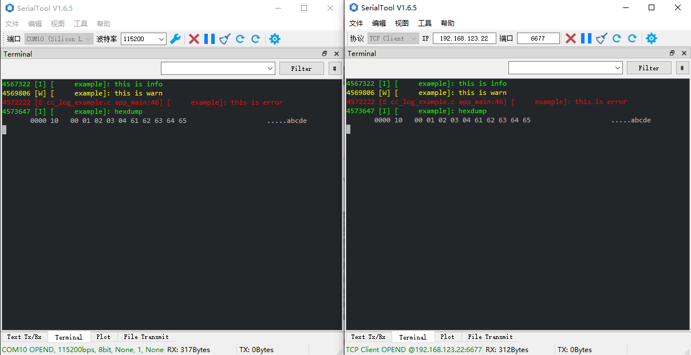

# cc_log
使用C编写的嵌入式log库
* 支持tcp log
* 支持hexdump
* 支持颜色显示和函数显示
* 支持单独文件设置log等级

    

### 例程
```
#define CONFIG_CC_LOG_FILE_LEVEL    CC_LOG_INFO

#include <stdio.h>

#include "freertos/FreeRTOS.h"
#include "freertos/task.h"

#include "esp_timer.h"

#include "cc_log.h"
#include "app_wifi.h"

static char* TAG = "example";

static uint64_t log_time(void){
    return esp_timer_get_time();
}

static int log_put(const char *log, uint16_t len){
    printf("%.*s", len, log);
    cc_tcps_log_put(log, len);
    return len;
}

void app_main(void)
{
    cc_log_set_put(log_put);
    cc_log_set_get_time(log_time);

    app_init_wifi();

    cc_tcps_log_init(6677);

    printf("\n\n");

    vTaskDelay(3000 / portTICK_PERIOD_MS);

    CC_LOGD(TAG, "this is debug"); //以被当前文件的第一行CONFIG_CC_LOG_FILE_LEVEL配置过滤
    CC_LOGI(TAG, "this is info");
    CC_LOGW(TAG, "this is warn");
    CC_LOGE(TAG, "this is error");

    uint8_t buf[10] = {0, 1, 2, 3, 4, 'a', 'b', 'c', 'd', 'e'}; 
    CC_LOGI_HEXDUMP(TAG, buf, 10);
}
```